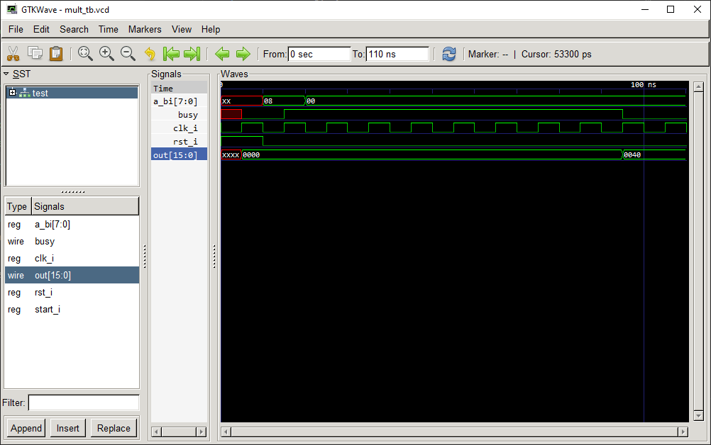

<!-- 
    Authors:
        Kutsenko Aleksei
        Solovev Pavel
    Group: 
        P33312
    
 -->
# Functional circuitry

## Lab 2

Compiling:

```bash
➜ iverilog mult.v mult_tb.v
```

Debug info and standart output:
```bash
➜ ./a.out                  

VCD info: dumpfile mult_tb.vcd opened for output.

       A                     OUT
xxxxxxxx (  x)  xxxxxxxxxxxxxxxx (    x)
       A                     OUT
00001000 (  8)  0000000000000000 (    0)
       A                     OUT
00000000 (  0)  0000000001000000 (   64)
```

Show diagram:
```bash
➜ gtkwave.exe mult_tb.vcd
```
